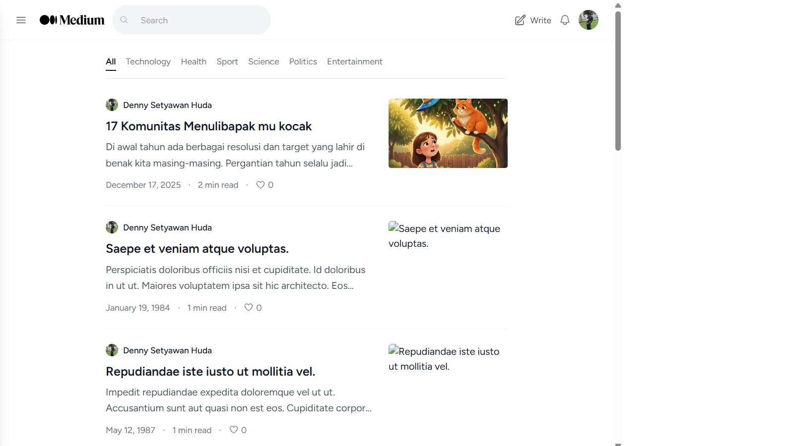
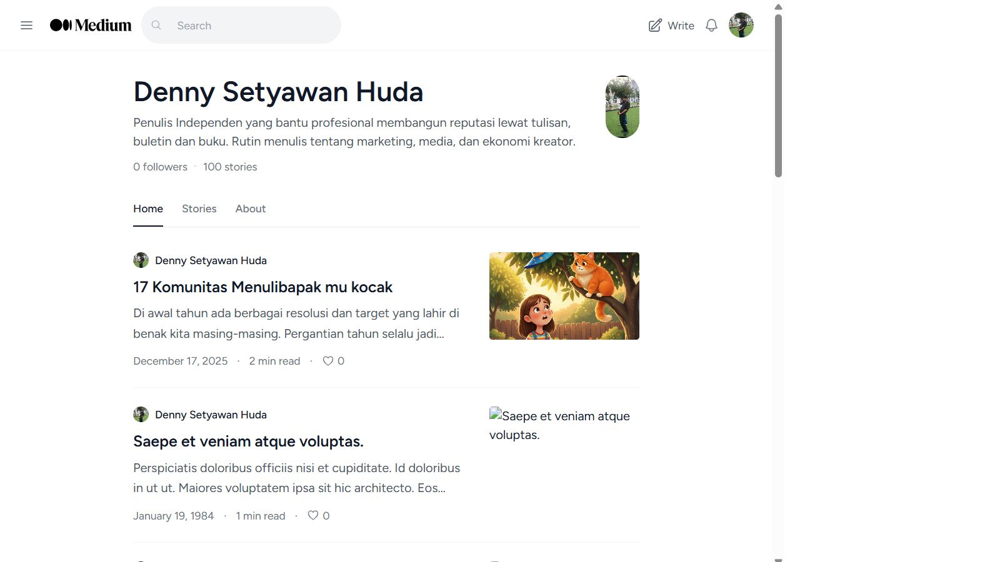

<div align="center">
  
  <h1>Medium Clone</h1>
  <p>A feature-rich Medium.com clone built with <strong>Laravel 12</strong>, <strong>Tailwind CSS</strong>, and <strong>Alpine.js</strong></p>

  <p>
    
    
    
    
    
  </p>
</div>

---

## 📋 Table of Contents

- [About](#-about)
- [Features](#-features)
- [Screenshots](#-screenshots)
- [Tech Stack](#-tech-stack)
- [Installation](#-installation)
- [Usage](#-usage)
- [Project Structure](#-project-structure)
- [Routes Overview](#-routes-overview)
- [Contributing](#-contributing)
- [License](#-license)

---

## 📖 About

**Medium Clone** is a full-featured blogging platform inspired by [Medium.com](https://medium.com). Users can create an account, write and publish stories, follow other writers, like posts, and explore content by category. The UI is carefully designed to mirror Medium's clean, content-first reading experience with a responsive layout, sliding sidebar, and elegant typography.

---

## ✨ Features

| Feature                 | Description                                                  |
| ----------------------- | ------------------------------------------------------------ |
| **User Authentication** | Register, login, logout, email verification, password reset  |
| **Profile Management**  | Edit avatar, name, username, bio, and account settings       |
| **Post Management**     | Create, edit, delete stories with TinyMCE rich text editor   |
| **Post Feed**           | Paginated feed with category filtering                       |
| **Like System**         | Ajax-powered clap/like with real-time counter                |
| **Follow System**       | Follow/unfollow users with real-time follower count          |
| **Category Browsing**   | Filter posts by categories (Technology, Health, Sport, etc.) |
| **Reading Time**        | Auto-calculated read time for each story                     |
| **Public Profiles**     | View any user's profile, stories, and bio                    |
| **Sliding Sidebar**     | Medium-like navigation overlay with burger menu              |
| **Who to Follow**       | Suggested users sidebar                                      |
| **Responsive Design**   | Mobile-friendly layout with Tailwind CSS                     |

---

## 📸 Screenshots

### 🏠 Home Page (Guest)



### 🔐 Login Page


### 📝 Register Page


### 🏠 Home Page (Authenticated)


### 📖 Post Detail



---

## 🛠 Tech Stack

| Technology                                                  | Purpose                            |
| ----------------------------------------------------------- | ---------------------------------- |
| **[Laravel 12](https://laravel.com/)**                      | PHP web framework (backend)        |
| **[Tailwind CSS 4](https://tailwindcss.com/)**              | Utility-first CSS framework        |
| **[Alpine.js 3](https://alpinejs.dev/)**                    | Lightweight JavaScript framework   |
| **[MySQL 8](https://www.mysql.com/)**                       | Relational database                |
| **[TinyMCE](https://www.tiny.cloud/)**                      | Rich text editor for story writing |
| **[Axios](https://axios-http.com/)**                        | HTTP client for Ajax requests      |
| **[Vite](https://vitejs.dev/)**                             | Frontend build tool                |
| **[Laravel Breeze](https://laravel.com/docs/starter-kits)** | Authentication scaffolding         |

---

## 🚀 Installation

### Prerequisites

- PHP 8.2+
- Composer
- Node.js & npm
- MySQL 8+

### Steps

```bash
# 1. Clone the repository
git clone https://github.com/dennyshuda/laravel-medium-clone.git
cd laravel-medium-clone

# 2. Install PHP dependencies
composer install

# 3. Install JavaScript dependencies
npm install

# 4. Copy environment file
cp .env.example .env

# 5. Configure database in .env
#    Edit DB_DATABASE, DB_USERNAME, DB_PASSWORD

# 6. Generate application key
php artisan key:generate

# 7. Run database migrations with seeders
php artisan migrate --seed

# 8. Create storage link
php artisan storage:link

# 9. Build frontend assets
npm run build

# 10. Start the development server
php artisan serve
```

> **Note:** The application is configured to run with **Laragon** out of the box. If using Laragon, simply point your Laragon site to the project folder.

### Default Test Account

After running `php artisan migrate --seed`, you can log in with:

| Field    | Value               |
| -------- | ------------------- |
| Email    | `example@gmail.com` |
| Password | `password`          |

---

## 💻 Usage

### Writing a Story

1. Log in to your account
2. Click the **Write** icon in the navigation bar
3. Enter your title, select a category, upload a featured image
4. Write your content using the TinyMCE editor
5. Click **Publish**

### Following Users

- Visit any user's profile
- Click the **Follow** button to start following them
- Click again to unfollow

### Liking Posts

- Click the **clap/hand** icon on any post to like it
- The count updates in real-time via Ajax
- Click again to unlike

### Browsing Categories

- Use the category tabs at the top of the home page
- Click a category to filter posts

---

## 📁 Project Structure

```
app/
├── Http/
│   ├── Controllers/
│   │   ├── Auth/          # Authentication controllers
│   │   ├── CategoryController.php
│   │   ├── FollowerController.php
│   │   ├── HomeController.php
│   │   ├── LikeController.php
│   │   ├── PostController.php
│   │   ├── ProfileController.php
│   │   └── PublicProfileController.php
│   └── Requests/          # Form request validation
├── Models/
│   ├── Category.php
│   ├── Follower.php
│   ├── Like.php
│   ├── Post.php
│   └── User.php
├── Providers/
└── View/Components/

database/
├── factories/
├── migrations/
└── seeders/
    └── DatabaseSeeder.php  # Seeds users, categories, and 100 posts

resources/
├── css/app.css             # Custom Tailwind styles
├── js/                     # Alpine.js & Axios setup
└── views/
    ├── auth/               # Login, register, password reset
    ├── components/         # Reusable Blade components
    ├── home/               # Home page feed
    ├── layouts/            # App & guest layouts
    ├── post/               # Post CRUD views
    └── profile/            # User profile views

routes/
├── web.php                 # Web routes
└── auth.php                # Authentication routes
```

---

## 🗺 Routes Overview

| Method  | URI                    | Name            | Description              |
| ------- | ---------------------- | --------------- | ------------------------ |
| GET     | `/`                    | `home.index`    | Home page with post feed |
| GET     | `/@{username}`         | `profile.show`  | Public user profile      |
| GET     | `/@{username}/about`   | `profile.about` | User about page          |
| GET     | `/@{username}/lists`   | `profile.lists` | User stories list        |
| GET     | `/@{username}/{slug}`  | `post.show`     | Single post view         |
| POST    | `/post`                | `post.store`    | Create new post          |
| GET     | `/post/create`         | `post.create`   | Create post form         |
| GET/PUT | `/post/{post}/edit`    | `post.edit`     | Edit post                |
| DELETE  | `/post/{post}/delete`  | `post.delete`   | Delete post              |
| POST    | `/follow/{user}`       | `follow`        | Follow/unfollow user     |
| POST    | `/like/{post}`         | `like`          | Like/unlike post         |
| GET     | `/category/{category}` | `category`      | Posts by category        |

---

## 🤝 Contributing

Contributions are welcome! Feel free to open issues or submit pull requests.

1. Fork the repository
2. Create your feature branch (`git checkout -b feature/amazing-feature`)
3. Commit your changes (`git commit -m 'feat: add amazing feature'`)
4. Push to the branch (`git push origin feature/amazing-feature`)
5. Open a Pull Request

---

## 📄 License

This project is licensed under the MIT License - see the [LICENSE](LICENSE) file for details.

---

<div align="center">
  <sub>Built with ❤️ using <a href="https://laravel.com">Laravel</a> & <a href="https://tailwindcss.com">Tailwind CSS</a></sub>
</div>
